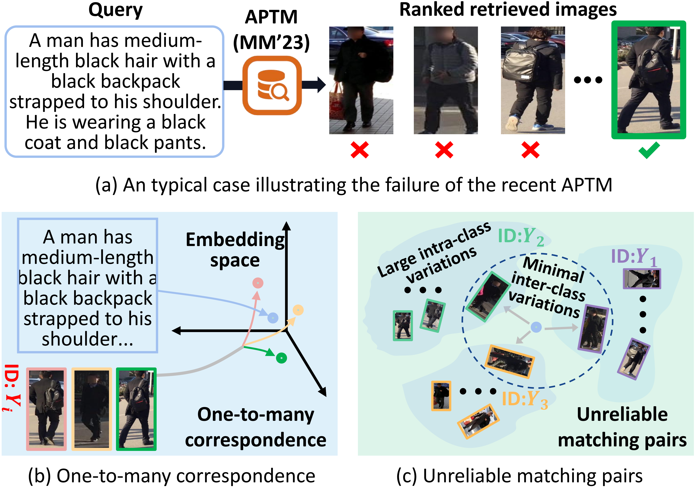
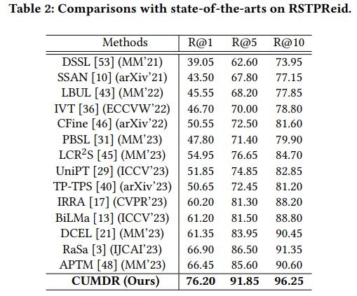
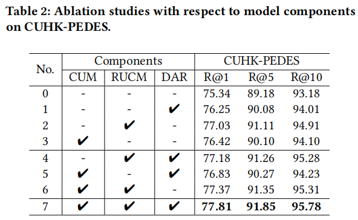

## Introduction
This is the source code of "Cross-modal Uncertainty Modeling with Diffusion-based Refinement for Text-based Person Retrieval". 

## Cross-modal Uncertainty Modeling with Diffusion-based Refinement for Text-based Person Retrieval
The CUMDR model is structured with three integral components:

1) **Cross-modal Uncertainty Modeling:** This component leverages Gaussian distribution to implicitly model uncertainty, facilitating the generation of diverse yet plausible retrievals.

2) **Retrieval-augmented Uncertainty-aware Complementary Matching:** Designed to address the detrimental impact of pairs characterized by excessive uncertainty, this component incorporates external matching strategies.

3) **Diffusion-based Alignment Refinement:** Focused on augmenting retrieval performance, this component frames the cross-modal relationship as a joint probability, contributing to an improved understanding of the inherent connections between modalities.


## Proposed Model (CUMDR)
* Cross-modal Uncertainty Modeling
* Retrieval-augmented Uncertainty-aware Complementary Matching
* Diffusion-based Alignment Refinement


## Motivation

Illustrative examples of existing problems: (a) Neglect of cross-modal uncertainty that stems from point representation strategy. (b) The limitation of discriminative models, i.e., only focuses on learning conditional probabilities.

## Results


## Ablation Study on CUHK-PEDES


## Effect of Retrieval-augmented In-context Constructor
To further explore the significance of our proposed Retrieval-augmented In-context Constructor (RIC), we conduct the corresponding ablation study on the RSTPReid dataset.


## More comparisons on CUHK-PEDES


## More Visualization of Distribution Representation
To further underscore the advantages of our CUMDR model, we visualize the textual and visual representations of the top-10 retrieved results in Figure 6 and Figure 7. Each ellipse represents the 50% confidence region for visual representations, with the textual query highlighted by a white ellipse with a 90% confidence region. Ground-truth targets are indicated by green boxes.


## Retrieval Examples


## Usage
* Download the CUHK-PEDES dataset, ICFG-PEDES dataset and RSTPReid dataset.
* External Annotations for RSTPReid are partly aviliable in `.\data\rstp_train.json`, full access will be aviliable soon.
* Training
```python
python3 run.py \
--task "itr_rstp" \
--dist "gpu0" \
--output_dir "your_output_path" \
--checkpoint "your_checkpoint_path.pth"
```
* Testing
```python
python3 run.py \
--task "itr_rstp" \
--dist "gpu0" \
--output_dir "your_output_path" \
--checkpoint "your_checkpoint_path.pth" \
--evaluate
```

